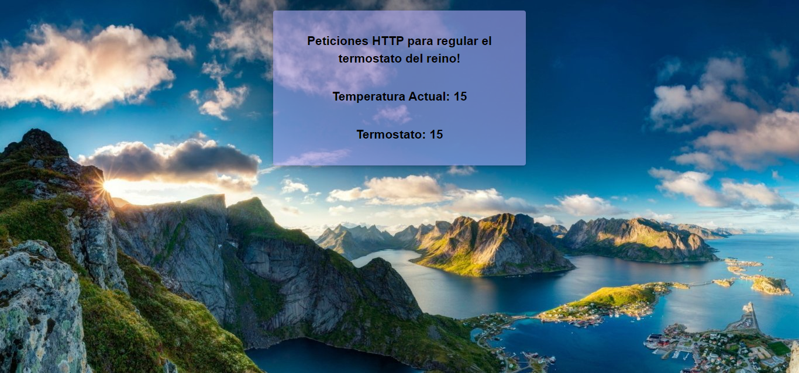

# 2 DAM - PSP

## AE5 - Generación de servicios en red

**> Instrucciones**

    Después que sus consejeros le dijeran aquello de “winter is coming”, Lord Eddard Stark ha decidido hacer una pequeña inversión y va a instalar algunas estufas de pellets en Invernalia. El modelo que le han recomendado lleva incorporado un pequeño servidor HTTP que permite el control remoto, pero el software de control no convence a Lord Stark y decide encargar un desarrollo en Java a algún técnico superior de DAM del reino.

**- Este software implementará las siguientes funcionalidades:**

- El servidor (Servidor.java) estará alojado en la IP 127.0.0.1 en el puerto 7777.

- El servidor aceptará peticiones a través del navegador en la ruta de contexto "/estufa".

- El servidor será multihilo y gestionará las peticiones desde la clase GestorHTTP.java.

- La clase GestorHTTP tendrá dos atributos: temperaturaActual y temperaturaTermostato. Inicialmente ambas temperaturas tendrán el mismo valor, por ejemplo 15º.

- El gestor HTTP de contexto puede proporcionar como GET el dato “temperaturaActual” ejemplo: (http://localhost:7777/estufa?temperaturaActual). Deberá “servir” al cliente una página HTML (formato libre) donde se vean ambas temperaturas (actual y termostato).

- El gestor HTTP aceptará como POST la instrucción “setTemperatura=X”, donde X es la temperatura que debe alcanzar la estufa (temperaturaTermostato). Deberá mostrar un mensaje informativo por pantalla en la aplicación Java y otro en el cliente Postman.

- Aparte de los métodos para gestionar los GET y POST, la clase GestorHTTP tendrá un método llamado “regularTemperatura()”. Este método se encargará de variar (aumentar o disminuir) la temperaturaActual de la estufa en 1 unidad hasta alcanzar la temperaturaTermostato que se haya pasado como parámetro POST. Para que el proceso de variación dure algo más de tiempo y se pueda ir consultando desde el navegador, habrá una pausa de 5 segundos entre cada aumento/disminución de la temperatura.

**> Observaciones**

Una vez iniciado el servidor HTTP, podemos probarlo desde el navegador con la dirección: http://localhost:7777/estufa?temperaturaActual

Asimismo, desde el gestor HTTP podemos probar el POST con la dirección: http://localhost:7777/estufa?setTemperatura=X donde X es la temperatura que queremos fijar como límite.

**> El contenido web que mostrará el servidor, será el siguiente:**

**> Recursos**

- URL de la branca _Master_: https://github.com/borealcoding/2DAM-PSP
- URL de la branca _AE5_: https://github.com/borealcoding/2DAM-PSP/tree/AE5
